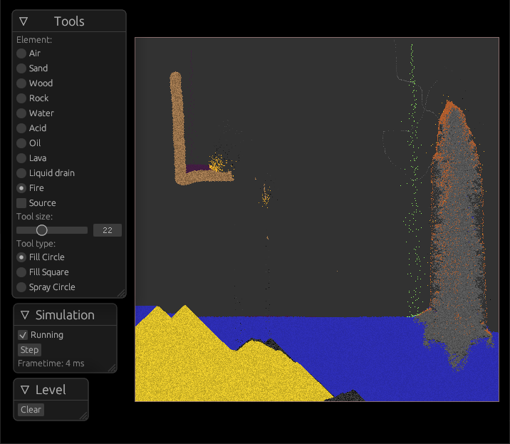
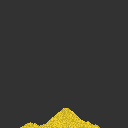
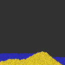

# Falling Rust

Falling-sand game written in Rust, Bevy and egui.

Simulating simplified physics. 

## Features
- Simulation of many different elements: sand, rock, wood, water, acid, oil, lava, fire, ash, smoke
- Editor with several tools: place circle, square or spray
- 512 x 512 cells sandbox to play around with
- Place a source for any element
- Liquid drains
- Pause and step the simulation
- Clear the level

## How does it work
Cellular automata.

Sand falls down and slides diagonally.

Water falls down, diagonally but also sideways.

Fire moves in all directions with a tendency upwards. It turns burnable elements into fire. Burns out over time.

